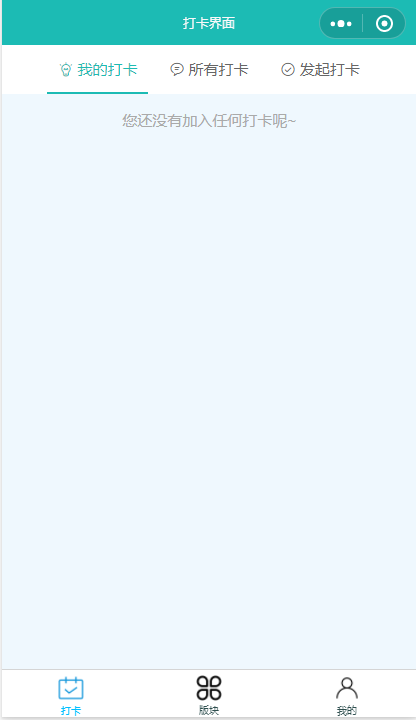
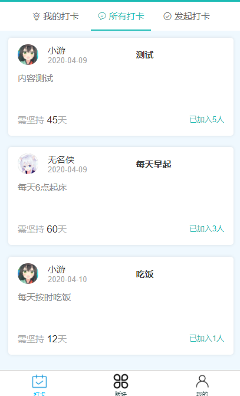
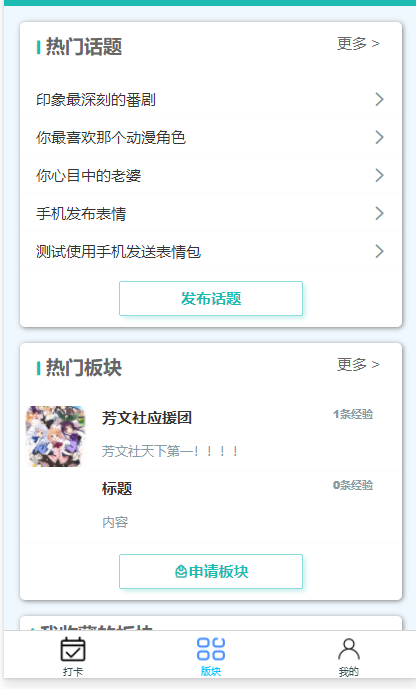
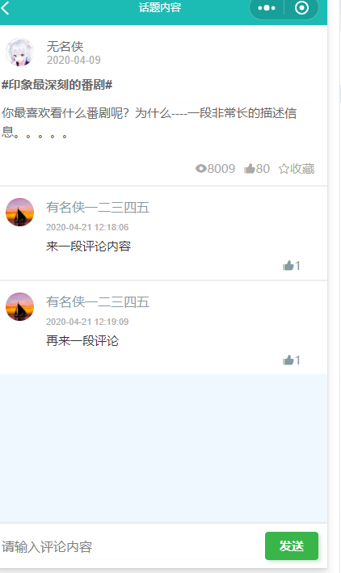
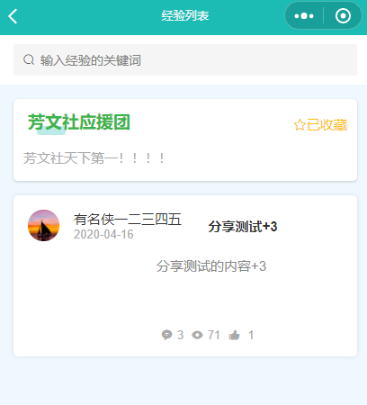
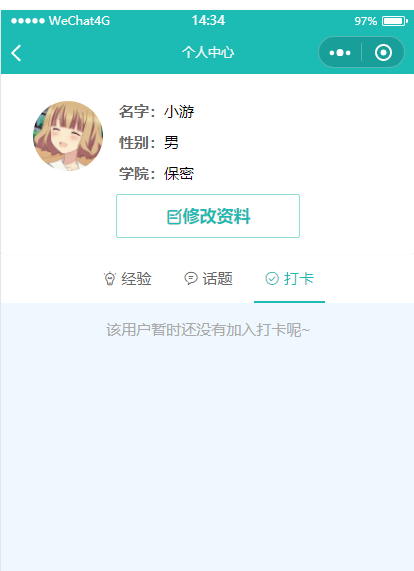
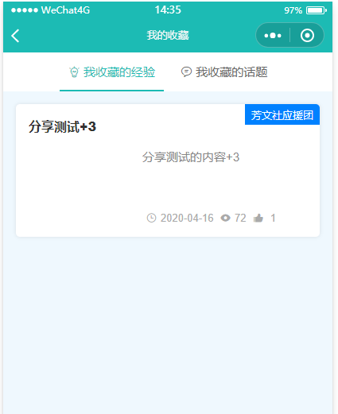
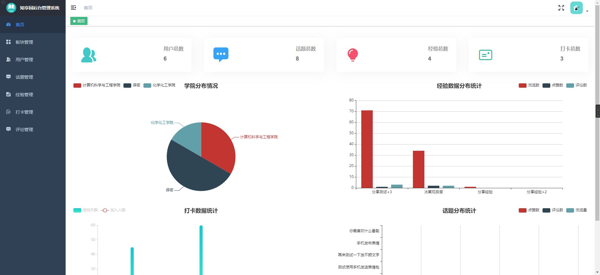

# 微信小程序开发赛参赛作品(知享园)

## 微信小程序端(界面截图)

github地址:https://github.com/xiaoyou-project/wechat_college_miniProgram

## 后端

github地址：https://github.com/xiaoyou-project/wechat_college_back

后端使用go进行开发，SQL脚本和接口文档都放在本项目的文件夹里面去了

## 管理员后台 

github地址：https://github.com/xiaoyou-project/wechat_college_admin

用户名admin

密码666

后台截图

